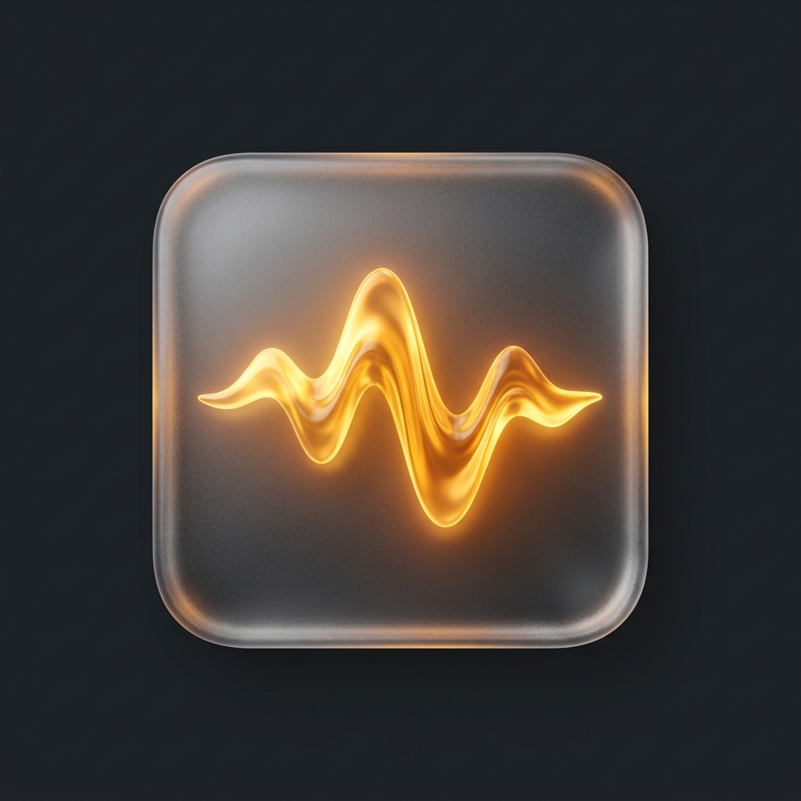
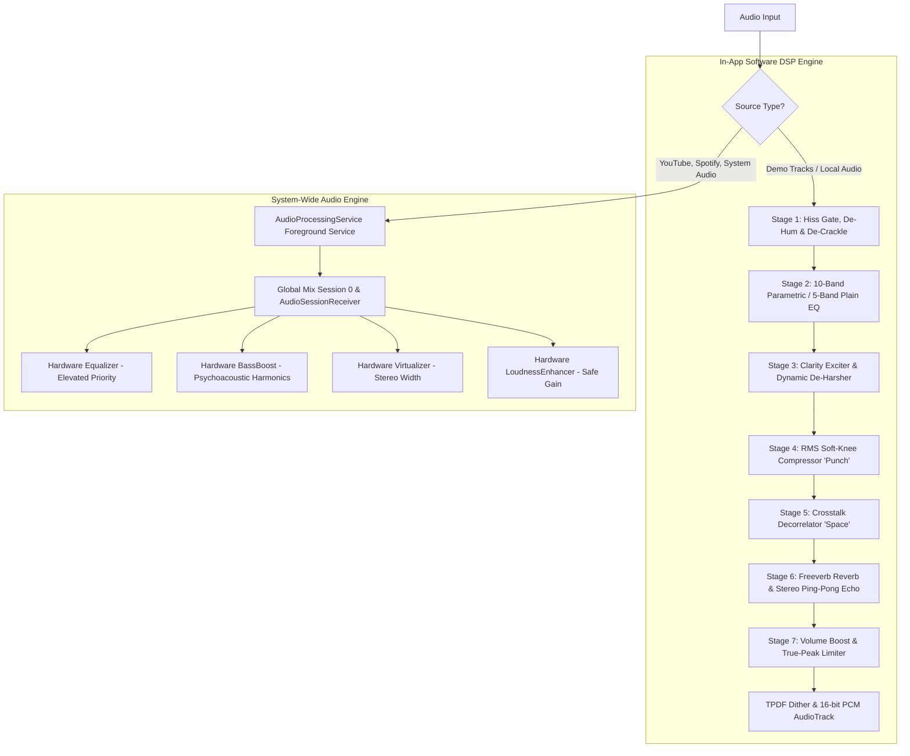

# Daydream Audio

<p align="center">
  
</p>

<h3 align="center">Sound the way you remember it.</h3>

<p align="center">
  A plain-English audio equalizer, acoustic virtualizer, and restoration suite for Android — built for people who don't know what "3.2 kHz" means, but know their favorite songs sound thin, muddy, hissy, or flat.
</p>

<p align="center">
  
  
  
  
  
</p>

---

## 💡 Why Daydream Audio? How is it different?

Every equalizer app on the Google Play Store ships the exact same interface: **a wall of 5 to 10 vertical sliders labeled in Hertz (60Hz, 230Hz, 910Hz...) and generic musical presets like "Rock", "Jazz", or "Pop".**

If you are an experienced sound engineer, that's fine. But for everyone else:
- You have an old cassette transfer, a vintage recording, or a compressed YouTube rip that **"sounds thin"** or **"has buried vocals"**.
- You have no idea which frequency slider controls "thinness", or whether the issue is actually tonal balance, compressed dynamics, or tape hiss.
- You push arbitrary sliders, distort the sound, get frustrated, and revert to default.

**Daydream Audio throws away the jargon.** It bridges the gap between how human beings describe sound and how audio DSP actually works.

---

### 🆚 Head-to-Head Comparison

| Feature | Generic Play Store EQs (Volume Booster, XEQ) | Pro EQs (Wavelet, Poweramp EQ) | **Daydream Audio** |
|---|---|---|---|
| **Interface Language** | Raw Hz (`60Hz, 230Hz...`) | Pure technical graphs & dB | **Plain English** (*Rumble, Warmth, Body, Clarity, Air*) |
| **Problem Diagnosis** | ❌ None (only "Rock/Jazz" presets) | ❌ None | ✅ **"What's wrong with my song?" Wizard** (1-tap fix) |
| **Noise & Hiss Removal** | ❌ Completely absent | ❌ Completely absent | ✅ **Active Hiss Gate, Mains De-Hum & De-Crackle** |
| **Dynamics Control** | ❌ None | Complex compressor settings | ✅ Single **"Punch"** macro with automatic soft knee |
| **A/B Instant Compare** | ❌ None or slow | Slow reload toggle | ✅ **Instant (<50ms) A/B comparison toggle** |
| **Acoustic Space** | Generic virtualizer knob | Crossfeed settings | ✅ **Space** slider + **Room Simulation** + **Mono Phase Guard** |
| **Time Travel & Lofi** | ❌ None | ❌ None | ✅ **Time Machine Presets** & **Lofi Slowed+Reverb Engine** |
| **Reverse Restoration** | ❌ None | ❌ None | ✅ **"Vintage-ify"** (analog noise & wow/flutter synthesis) |
| **Ear Training** | ❌ None | ❌ None | ✅ **Golden Ear Trainer** (gamified listening challenge) |
| **System-Wide Playback** | Often broken / kills audio | Requires ADB for global mode | ✅ **Foreground Service with Session 0 + Broadcast Hooks** |
| **Clipping Prevention** | ❌ Distorts horribly at high volume | True peak limiter | ✅ **Smart True-Peak Brickwall Limiter** on Volume Boost |

---

## 🎯 Core Concept: "Translate the Slider"

Every control in Daydream Audio operates across three progressive layers of understanding:

1. **The Plain-English Anchor** *(Always visible)*:
   Sliders are labeled with intuitive terms like **Warmth**, **Punch**, **Space**, and **Air**.
2. **The Problem & Consequence Description** *(On tap/tooltip)*:
   Explains what the slider does and what happens if pushed too far:
   > *"Turn up **Body** if vocals sound buried. Be careful: too much makes audio sound boxy."*
3. **The Engineering Value** *(Available on demand)*:
   Enthusiasts can toggle **"Show Technical Values"** in Settings or flip to **Advanced Mode** to see exact biquad center frequencies, Q factors, compressor ratios, and threshold decibels.

---

## 🚀 Key Features

### 1. 🪄 "What's Wrong With My Song?" Diagnostic Wizard
Instead of forcing you to hunt for frequencies, Daydream Audio asks one simple question: **"What's wrong with your sound right now?"**
Select your complaint:
- 🔊 *"Sounds thin / tinny"* → Boosts Warmth (+6dB) & Body (+4dB), adds Punch compressor makeup.
- 🌫️ *"Sounds muddy / boxy"* → Cuts muddy Body (-5dB), lifts Clarity (+5dB).
- 🎤 *"Vocals buried"* → Brings lead vocals forward with targeted 1kHz–3kHz presence and dynamic leveling.
- ⚡ *"Too harsh / sibilant"* → Attenuates piercing 4kHz–8kHz highs for fatigue-free listening.
- 🕳️ *"Sounds flat / lifeless"* → Shapes a musical smiley curve, expands stereo Space, and adds punch.
- 📻 *"Hissy / noisy"* → Routes directly to the noise reduction subsystem (hiss gate + de-hum + de-crackle).

### 2. ⚡ Instant A/B Compare (<50ms)
Audio memory fades within seconds. The persistent floating **A/B button** allows instant, pop-free switching between the raw unprocessed audio and the enhanced Daydream signal so you can verify the improvement with your own ears.

### 3. 🛡️ Smart Stereo "Space" with Mono Phase Guard
Standard stereo virtualizers widen audio by decorrelating left and right channels. However, applying stereo virtualization to vintage mono recordings (60s music, podcasts, old YouTube audio) creates severe phase cancellation and hollow sound. 
Daydream Audio **continuously calculates the real-time cross-channel correlation coefficient**. When mono audio is detected, it automatically caps the Space slider at 35% and surfaces a warning to prevent phase distortion.

### 4. 🕰️ Time Machine & Reverse Time Machine ("Vintage-ify")
- **Time Machine Presets**: Pre-configured acoustic restoration profiles tuned to specific historical eras and recording formats:
  - *60s Mono Transfer* (Vinyl & tube console warmth)
  - *70s Magnetic Tape* (Tape saturation recovery & high-shelf hiss reduction)
  - *80s Cinema Print* (Dialogue intelligibility & optical soundtrack hiss gate)
  - *90s FM Broadcast* (Loud airplay curve with heavy broadcast punch)
  - *Early Digital MP3* (De-harshening of 128kbps swirl and metallic sibilance)
- **Reverse Time Machine ("Vintage-ify")**: Flips the restoration DSP in reverse! Adds authentic analog wow & flutter pitch warble (via an LFO-driven fractional delay line) and synthesizes analog tape hiss, vinyl pops, and mains hum to turn modern songs or voice memos into nostalgic memories.

### 5. 🎧 Dreamy Lofi Mode (Slowed + Reverb)
One-tap transformation for any track:
- Slowed playback tempo (0.85x) with pitch preservation
- Stereo ping-pong tape delay
- 8-comb Freeverb algorithmic reverberation network
- Analog tape flutter & warm acoustic EQ tilt

### 6. 👂 Golden Ear Trainer
A gamified ear-training challenge built right into the app. Daydream Audio plays a test tone or song, applies a subtle boost or cut to one plain-language band, and challenges you to identify whether it was **Warmth**, **Body**, **Clarity**, or **Air**. Builds listening confidence while tracking your audiophile streak.

### 7. 🔊 Safe Volume Boost with True-Peak Limiter
Generic "Volume Boost" apps simply multiply digital samples, pushing the waveform into hard digital square-wave clipping. Daydream Audio combines Android's `LoudnessEnhancer` with a custom **soft-knee true-peak brickwall limiter**, boosting volume while preventing speaker buzz and harsh digital distortion.

---

## ⚙️ Dual-Engine Architecture

Daydream Audio features an intelligent split-engine pipeline:



### 1. The In-App Software DSP Engine
- 32-bit floating point internal processing pipeline.
- Anti-denormal flush protection and NaN/Inf isolation across all biquad filter states.
- 8-Comb + 4-AllPass Schroeder/Freeverb algorithmic reverberation.
- Fractional delay ring buffers for Doppler-accurate wow & flutter analog tape simulation.
- Real-time spectrum FFT analyzer feeding the reactive Sonic Glass UI.

### 2. The System-Wide Hardware Engine
- Powered by a background **`AudioProcessingService`** with `FOREGROUND_SERVICE_MEDIA_PLAYBACK` to prevent Android from killing effects when switching to YouTube or Spotify.
- Controls Android's hardware DSP via `android.media.audiofx.Equalizer`, `android.media.audiofx.BassBoost`, `android.media.audiofx.Virtualizer`, and `android.media.audiofx.LoudnessEnhancer`.
- Uses elevated priority to override default OEM audio skins (Dolby Atmos, Xiaomi Sound, Dirac).
- Dynamically drives hardware **`BassBoost`** from the Rumble, Warmth, and Punch sliders, ensuring that low frequencies are clearly audible even on tiny smartphone speaker drivers.

---

## 🎨 Design System: "Liquid Glass"

Built natively from scratch using **Jetpack Compose**:
- **Translucent Layering**: Multi-tier frosted glass surfaces (`BackdropFilter` styling with blur and specular highlights).
- **Sonic Glass Background**: An ambient, audio-reactive glass gradient that subtly breathes, ripples, and pulses in real time with the audio's RMS amplitude and frequency spectrum.
- **Accessibility Modes**:
  - **Reduce Glass**: Toggles high-contrast solid backgrounds for direct sunlight visibility.
  - **Reduce Motion**: Disables spring physics and transitions for battery saving or motion sensitivity.

---

## 🛠️ Building & Installation

### Prerequisites
- Android Studio Ladybug (2024.2+) or Android SDK Tools with API 35
- JDK 21
- Android device or emulator running **Android 7.0+ (API 24+)**

### Clone & Build
```bash
# Clone the repository
git clone https://github.com/kashyapgithub/daydream-audio.git
cd daydream-audio

# Build debug APK
./gradlew assembleDebug

# Run unit tests
./gradlew testDebugUnitTest
```
The compiled APK will be located at:
`app/build/outputs/apk/debug/app-debug.apk`

---

## 🔒 Privacy & Permissions

Daydream Audio is designed with a **zero-friction, privacy-first architecture**:
- **No Internet Permission**: The app does not request or use internet access. Zero telemetry, zero tracking, zero ads.
- **No Dangerous Storage Permissions**: Local track imports use the Android system file picker (`ACTION_OPEN_DOCUMENT`), requiring no access to your personal files or photos.
- **No Microphone Access**: Audio processing runs entirely through Android's media playback and effect framework without recording your microphone.

---

## 📄 License

Distributed under the MIT License. See `LICENSE` for details.

---

<p align="center">
  Crafted with care for music lovers who cherish old memories.
</p>
